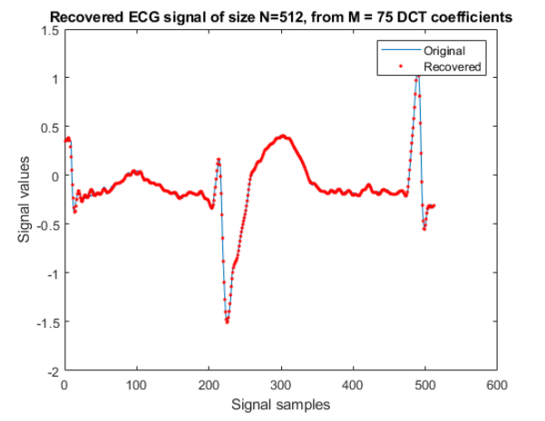
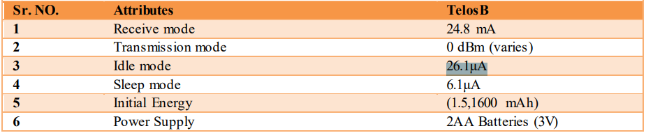
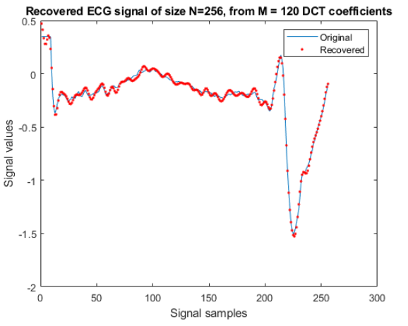

# Data Compression using Discrete Cosine Transform(DCT) in TelosB Mote/Cooja #
The following exercieses, data compression using discrete cosine transform (DCT) time-series signals. For testing electrocardiogram (ECG) signals will be
used. DCT-II transform of a length N signal x is given as:


<br/>
where y_k is the k'th DCT coefficient of the signal, x, for a particular k.

<br/> 

The ECG signal that the mote will be compression is the following signal of size N=512


## Goal for this exercise

* Implement and measure the execution time and energy consumption for the following cases, where N = Signal length, M = DCT coefficients 
  * N = 256 and M = 120
  * N = 512 and M = 75
*  Measure the mean square error between the original signal and reconstructed signal for both the cases.

*Optimization possibilities*
* Pi/N is a constant, and should only be calculated once (**Implemented**)
* When both n & k gets big, the compression will have to take cosine of a big number meaning the algorithm will be slower and slower when we choose a higer signal size N. Instead of taking cosine of some big number, which is very slow. Take cosine of a number that are approximaly the same cosine output as the big number (**Not implemented**) 


# Results
## DCT: N = 256 and M = 120
**Results from recovered DCT coefficients from Telos B mote**



**Execution time**
* 2659 seconds
* 2659/60 = 44,31 mins 

**Energy consumption**


* Receive mode/transmission mode takes around the same amount of energy
* Receive mode/transmission mode is 950 times more expensive than using CPU time
* That is why it is worth using more time on the CPU doing the compression and then on sending 75/256 = 29,29% of the signal to minimize the usage of the atenna
* CPU time consumtion = 2659*26.1 uA = 69,399 mA
  * Currently the algortihm takes way to long (cos(SomeBigNumber) is very slow) 

**Mean square error between the original signal and reconstructed signal**
* From matlab: 
  * mse(x,x_recovered) = 0.1190


## DCT: N = 512 and M = 75
**Results from recovered DCT coefficients from Telos B mote**



**Execution time**
* 14951  seconds
* 14951/60 = 249 mins 

**Energy consumption**
* CPU time consumtion = 14951*26.1 uA = 390 mA
  * Currently the algortihm takes way to long (cos(SomeBigNumber) is very slow) 

**Mean square error between the original signal and reconstructed signal**
* From matlab: 
  * mse(x,x_recovered) = 0.1554


## Conclusion ##
Sensor nodes can use more time of the CPU and less time on the atenna by compressing the signal using DCT. Depending of how precise the signal values needs to be at the receiver side, we can adjust the size of M. 
* small M = faster transmission/less quality
* big M   = slower transmission/better quality

The recovery of the ECG signal was a succes, but the time taken to produce the DCT compression on mote was way to expenssive. The time for *cos(SomeBigNumer)* is the overhead in the algorithm. 

When both n & k gets big, the compression will have to take cosine of a big number meaning the algorithm will be slower and slower when we choose a higer signal size N. Instead of taking cosine of some big number, which is very slow. Take cosine of a number that are approximaly the same cosine output as the big number (**For future work**) 


## Build commands ##
Make and upload telos b
```
make TARGET=sky MOTES=/dev/ttyUSB0 DCT.upload login
```
Check serial port:
```
make TARGET=sky motelist
```
compile and upload program
```
make TARGET=sky PORT=/dev/ttyUSB0 DCT.upload
```
ssh on the sensor
```
make TARGET=sky PORT=/dev/ttyUSB0 login
```
Clean build
```
make TARGET=sky distclean
```
local sky build

```
make TARGET=sky
```
