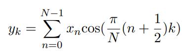
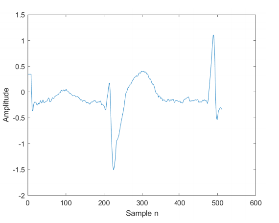

# Data Compression using Discrete Cosine Transform in TelosB Mote/Cooja #
The following exercieses, data compression using discrete cosine transform (DCT) time-series signals. For testing electrocardiogram (ECG) signals will be
used. DCT-II transform of a length N signal x is given as


where y_k is the k'th DCT coefficient of the signal, x, for a particular k. It can be also
be rewritten in the matrix form as

The ECG signal that the mote will be compression is the following signal of size N=512



## Build commands ##
Make and upload telos b
```
  make TARGET=sky MOTES=/dev/ttyUSB0 knockDetector.upload login
```
 Check serial port:
```
make TARGET=sky motelist
```
compile and upload program
```
make TARGET=sky PORT=/dev/ttyUSB0 knockDetector.upload
```
ssh on the sensor
```
make TARGET=sky PORT=/dev/ttyUSB0 login
```
Clean build
```
make TARGET=sky distclean
```
local sky build

```
 make TARGET=sky
```


## Goal for this exercise

* Implement and measure the execution time and energy consumption for the following cases, where N = Signal length, M = DCT coefficients 
  * N = 256 and M = 75
  * N = 512 and M = 120
*  Measure the mean square error between the original signal and reconstructed signal for both the cases.

*Optimization possibilities*
* Pi/N is a constant, and should only be calculated once (**Implemented**)
* When both n & k gets big, the compression wil have to take cosine of a big number meaning the algorithm will be slower and slower when we choose a higer signal size N. Instead of taking cosine of some big number, which is very slow. Take cosine of a number that are approximaly the same cosine output as the big number (**Not implemented**) 


## Password Recording ##
*Secret password recording*
* At program start a led indicater will blink 3 times.
* When all Red,Green & Blue led is on the recording is active (10 sec)
* After the recording period, the user ends with at button press.

*login recording*
* The mote will be locked, indicated by the Red led.
* When the user presses a sequence of button clicks the Blue led will indicate (login recording)
* If the password is acceptable with ACCEPT_THRESHOLD then the Green led will indicate succes
* If not, the Red led with indicate locked, and the user is able to retry the login sequence

*storage logic*

* For each password the user has 10 sec(1280 clock ticks) to input presses (Maximum 13 presses)
* Each press gets stored within a time slot(128 ticks/1sec)   array of size [13]


```
[0-128, 128-256, 256-384, 384-512, 512-640, 640-768, 786-896, 896-1024, 1024-1152, 1152-1280]
```


## Signal ##
Since the storage logic, each signal will have the following form indicated by the example with 2 button presses with 2 time slots


